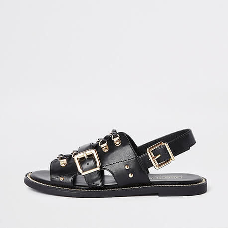
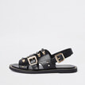
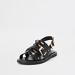
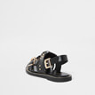

                

                    

                        

                            

                                

                                    

                                        

                                            <figure class="product-main-image">
                                                Top
                                                <!---->
                                                <?php
                                                echo "  ";
                                                 ?>

                                                <a href="#" id="btn-product-gallery" class="btn-product-gallery">
                                                    <i class="icon-arrows"></i>
                                                </a>
                                            </figure><!-- End .product-main-image -->

                                            

                                                <a class="product-gallery-item active" href="#" data-image="assets/images/products/single/sidebar-gallery/1.jpg" data-zoom-image="assets/images/products/single/sidebar-gallery/1-big.jpg">
                                                    
                                                </a>
                                                

                                                <a class="product-gallery-item" href="#" data-image="assets/images/products/single/sidebar-gallery/2.jpg" data-zoom-image="assets/images/products/single/sidebar-gallery/2-big.jpg">
                                                    
                                                </a>

                                                <a class="product-gallery-item" href="#" data-image="assets/images/products/single/sidebar-gallery/3.jpg" data-zoom-image="assets/images/products/single/sidebar-gallery/3-big.jpg">
                                                    
                                                </a>

                                                <a class="product-gallery-item" href="#" data-image="assets/images/products/single/sidebar-gallery/4.jpg" data-zoom-image="assets/images/products/single/sidebar-gallery/4-big.jpg">
                                                    
                                                </a>
                                            
<!-- End .product-image-gallery -->
                                        
<!-- End .product-gallery -->
                                    
<!-- End .col-md-6 -->

  